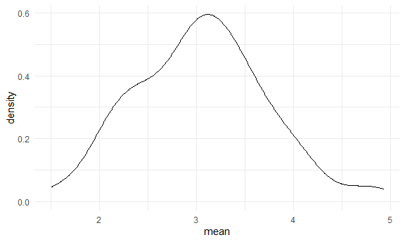
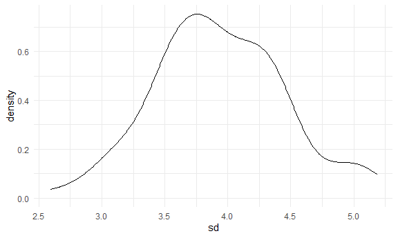

Simulations
================

## Let’s simulate something

I have a function:

``` r
sim_mean_sd = function(samp_size, mu = 3, sigma = 4) {
  
  sim_data = 
    tibble(
      x = rnorm(n = samp_size, mean = mu, sd = sigma)
      )

sim_data %>% 
  summarize(mean = mean(x), sd = sd(x))
  
}
```

I can simulate something:

``` r
sim_mean_sd(30)
```

    ## # A tibble: 1 x 2
    ##    mean    sd
    ##   <dbl> <dbl>
    ## 1  2.12  4.27

## Let’s simulate a lot

Let’s start with a `for` loop:

``` r
output = vector("list", 100)

for(i in 1:100) {
  
  output[[i]] = sim_mean_sd(samp_size = 30)
  
}

bind_rows(output)
```

    ## # A tibble: 100 x 2
    ##     mean    sd
    ##    <dbl> <dbl>
    ##  1  2.78  3.86
    ##  2  2.52  3.10
    ##  3  3.01  3.80
    ##  4  2.61  3.56
    ##  5  3.65  3.85
    ##  6  2.71  3.93
    ##  7  3.93  3.50
    ##  8  4.05  4.40
    ##  9  3.09  4.21
    ## 10  3.69  3.55
    ## # ... with 90 more rows

Let’s use a loop function:

``` r
sim_results = 
  rerun(100, sim_mean_sd(samp_size = 30)) %>% 
  bind_rows()
```

Let’s look at results:

``` r
sim_results %>% 
  ggplot(aes(x = mean)) + geom_density()
```



``` r
sim_results %>% 
  summarize(
    avg_samp_mean = mean(mean),
    sd_samp_mean = sd(mean)
  )
```

    ## # A tibble: 1 x 2
    ##   avg_samp_mean sd_samp_mean
    ##           <dbl>        <dbl>
    ## 1          3.05        0.677

``` r
sim_results %>% 
  ggplot(aes(x = sd)) + geom_density()
```


