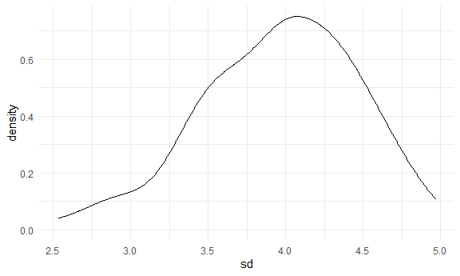

Simulations
================

## Let’s simulate something

I have a function:

``` r
sim_mean_sd = function(samp_size, mu = 3, sigma = 4) {
  
  sim_data = 
    tibble(
      x = rnorm(n = samp_size, mean = mu, sd = sigma)
      )

sim_data %>% 
  summarize(mean = mean(x), sd = sd(x))
  
}
```

I can simulate something:

``` r
sim_mean_sd(30)
```

    ## # A tibble: 1 x 2
    ##    mean    sd
    ##   <dbl> <dbl>
    ## 1  3.33  3.70

## Let’s simulate a lot

Let’s start with a `for` loop:

``` r
output = vector("list", 100)

for(i in 1:100) {
  
  output[[i]] = sim_mean_sd(samp_size = 30)
  
}

bind_rows(output)
```

    ## # A tibble: 100 x 2
    ##     mean    sd
    ##    <dbl> <dbl>
    ##  1  3.53  3.18
    ##  2  3.44  3.84
    ##  3  3.45  3.53
    ##  4  1.68  3.69
    ##  5  3.95  4.22
    ##  6  3.27  4.34
    ##  7  2.05  4.05
    ##  8  3.10  3.72
    ##  9  3.55  4.11
    ## 10  3.87  3.79
    ## # ... with 90 more rows

Let’s use a loop function:

``` r
sim_results = 
  rerun(100, sim_mean_sd(samp_size = 30)) %>% 
  bind_rows()
```

Let’s look at results:

``` r
sim_results %>% 
  ggplot(aes(x = mean)) + geom_density()
```


``` r
sim_results %>% 
  summarize(
    avg_samp_mean = mean(mean),
    sd_samp_mean = sd(mean)
  )
```

    ## # A tibble: 1 x 2
    ##   avg_samp_mean sd_samp_mean
    ##           <dbl>        <dbl>
    ## 1          2.98        0.756

``` r
sim_results %>% 
  ggplot(aes(x = sd)) + geom_density()
```



## Let’s try other sample sizes

``` r
n_list = 
  list(
    "n = 30" = 30,
    "n = 60" = 60,
    "n = 120" = 120,
    "n = 240" = 240
  )

output = vector("list", length = 4)

output[[1]] = rerun(100, sim_mean_sd(samp_size = n_list[[1]])) %>% bind_rows()
output[[2]] = rerun(100, sim_mean_sd(samp_size = n_list[[2]])) %>% bind_rows()

for (i in 1:4) {
  
  output[[i]] = 
    rerun(100, sim_mean_sd(samp_size = n_list[[i]])) %>% 
    bind_rows()
  
}

output
```

    ## [[1]]
    ## # A tibble: 100 x 2
    ##     mean    sd
    ##    <dbl> <dbl>
    ##  1  2.73  3.70
    ##  2  2.86  3.91
    ##  3  3.19  3.87
    ##  4  3.40  4.14
    ##  5  2.41  4.21
    ##  6  3.45  3.98
    ##  7  3.35  4.46
    ##  8  2.96  4.14
    ##  9  3.43  3.50
    ## 10  3.71  4.41
    ## # ... with 90 more rows
    ## 
    ## [[2]]
    ## # A tibble: 100 x 2
    ##     mean    sd
    ##    <dbl> <dbl>
    ##  1  2.81  3.99
    ##  2  3.09  4.42
    ##  3  1.97  3.71
    ##  4  3.94  3.61
    ##  5  3.10  3.59
    ##  6  3.41  3.96
    ##  7  2.26  4.17
    ##  8  2.55  4.34
    ##  9  3.46  4.22
    ## 10  2.65  4.51
    ## # ... with 90 more rows
    ## 
    ## [[3]]
    ## # A tibble: 100 x 2
    ##     mean    sd
    ##    <dbl> <dbl>
    ##  1  3.38  4.18
    ##  2  3.06  3.72
    ##  3  2.32  3.68
    ##  4  3.29  3.67
    ##  5  2.97  3.96
    ##  6  3.07  4.06
    ##  7  3.68  3.77
    ##  8  2.51  4.09
    ##  9  3.62  3.72
    ## 10  2.67  4.14
    ## # ... with 90 more rows
    ## 
    ## [[4]]
    ## # A tibble: 100 x 2
    ##     mean    sd
    ##    <dbl> <dbl>
    ##  1  2.89  3.95
    ##  2  3.41  4.12
    ##  3  2.70  4.03
    ##  4  2.42  4.09
    ##  5  3.00  3.68
    ##  6  3.14  3.83
    ##  7  2.87  4.26
    ##  8  2.16  4.06
    ##  9  2.92  4.32
    ## 10  3.06  4.16
    ## # ... with 90 more rows

``` r
sim_results = 
  tibble(
    sample_size = c(30, 60, 120, 240)
) %>% 
    mutate(
      output_lists = map(.x = sample_size, ~ rerun(500, sim_mean_sd(.x))),
      estimate_df = map(output_lists, bind_rows)
  ) %>% 
    select(-output_lists) %>% 
    unnest(estimate_df)
```

Do some dataframe things:

``` r
sim_results %>% 
  mutate(sample_size = str_c("n = ", sample_size),
         sample_size = fct_inorder(sample_size)) %>% 
  ggplot(aes(x = sample_size, y = mean)) +
  geom_violin()
```


``` r
sim_results %>% 
  group_by(sample_size) %>% 
  summarize(
    avg_samp_mean = mean(mean),
    sd_samp_mean = sd(mean)
  )
```

    ## `summarise()` ungrouping output (override with `.groups` argument)

    ## # A tibble: 4 x 3
    ##   sample_size avg_samp_mean sd_samp_mean
    ##         <dbl>         <dbl>        <dbl>
    ## 1          30          3.00        0.721
    ## 2          60          2.99        0.512
    ## 3         120          3.01        0.368
    ## 4         240          3.00        0.268
